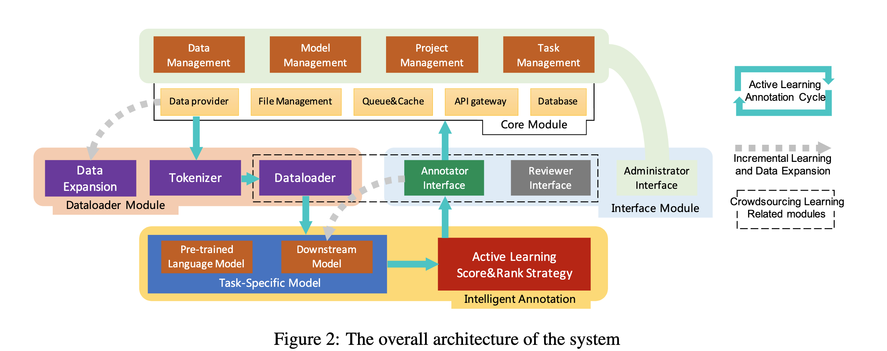
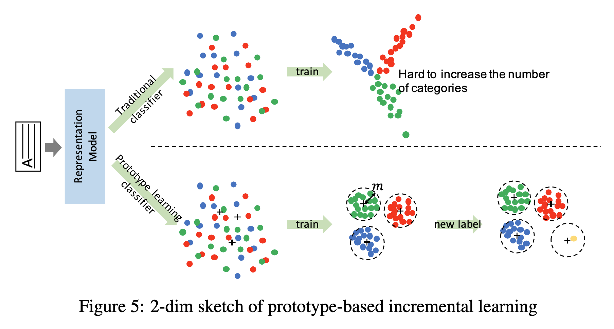
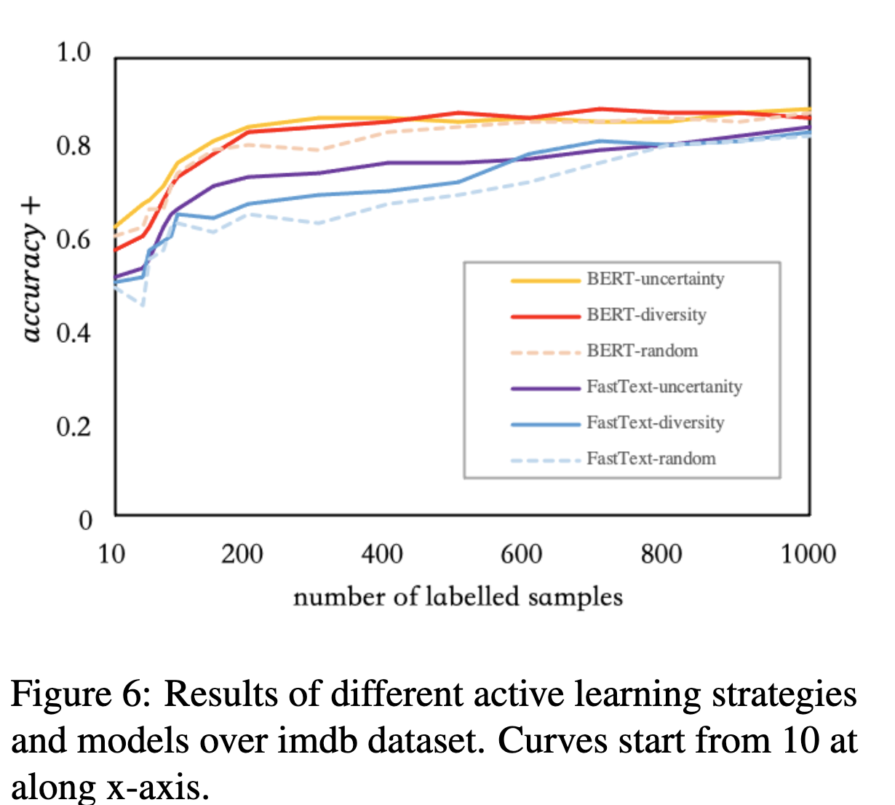
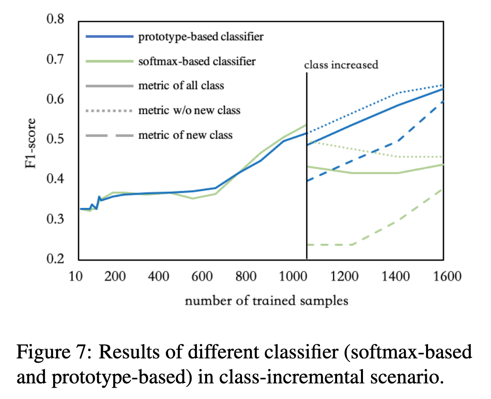

# FITAnnotator: A Flexible and Intelligent Text Annotation System

## 背景・目的

既存のアノテーションプラットフォームは英語のみを対象としているものがほとんどであるため、多言語に対応できるようなプラットフォームを提案、開発した。

## 関連研究との違いは？

[[Klie2018]]では、ほとんど英語のみを対象としているシステムになっている.

## 提案：解決に向けたキーアイデア

アノテーション支援を行うために用いる深層学習モデルをActive Learningを用いて推薦モデルの学習を行う。（下図の赤い部分）

また、新しいラベル（アノテーションタグ）に対応するために、Incremental Learningを用い追加で学習をさせる
下の図の下半分のような分布になるように特徴を抽出する（各色はクラスラベルを表していて、黄色が新しいラベルに該当する）
クラス間マージンを最大化しつつ、クラス内マージンを最小化するようになっている。

## 結果:結局問題は解決されたのか．新しくわかったことは？

### Active Learningについての評価
IMDb movie reviews sentiment classification taskで評価を行った。
使用モデルはBERTとFastTextの2種類。
サンプリング方法はuncertainty samplingとdiversity samplingとrandom samplingの3種類。
評価指標はaccuracy+を用いている。
モデルの評価は、新しくアノテーションされたサンプルが100種類追加された段階で計測している

結果は下図の通り。
サンプルの方法でパフォーマンスは大きく変わらなかったが、randam samplingは他の2種類の手法に比べて遅かったことがわかった。

### Incremental Learningについての評価

AG News Datasetを用いて実験を行い、1000サンプルをアノテーションしたところで新しいクラスを追加しF1スコアで評価した。

prototype-besed classifierが提案している手法（Fig5の下側）で、softmax-based classifierが比較手法（Fig5の上側）。
細かい点線が新しいクラスを含まなかった場合のスコア、幅の広い点線が新しいクラスのみに対するスコア。

Incremental Learningを用いた場合の方が、新しいクラスを追加した時よりもスコアがあまり下がっていない（サンプルが増えるとF1も増加しているので有効で合ったことがわかる）
