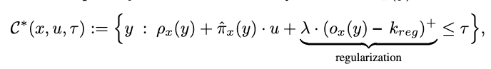
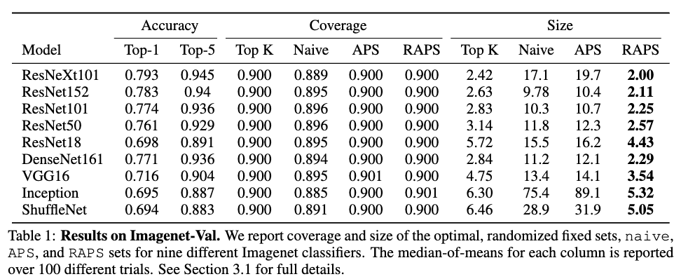

# Uncertainty Sets for Image Classifiers using Conformal Prediction

## 背景・目的

人間の意思決定を支援する手法にConformal Predictionがある。
Conformal Predictionでは、モデルの予測候補を提示することで人間の意思決定を支援している。

既存手法では、提示される予測候補が大きくなりすぎるという課題がある。
そこで、提案される予測候補の数に対して制約をかけた手法を提案した。

## 関連研究との違いは？

[[romano2020]]の手法を拡張した手法になっている。
ここで提案されている手法よりも、提案する予測数が小さく、正解が含まれているようなセットを提案する。

## 提案：解決に向けたキーアイデア

特徴量$x$に対して、提案される予測ラベルの集合を$C(x,u,\tau)$とする。
提案手法の予測セットの計算は以下の通り。

$\rho_x(y)$がクラス$y$よりも予測確率の高いラベル集合の確率値の和で、$\hat{\pi}_x(y)$がクラス$y$に対する予測確率を表す。
$o_x(y)$はクラス$y$よりも大きな予測確率を持つラベルの数を表しており、$k_{reg}$が制約パラメータになっている。
$\tau$が確率値の累積わのスコアの上限値を表している。

３項目が制約項になっていて、$k_{reg}$よりも提案数が大きくなった場合に制約がかかるようになっている。

## 結果:結局問題は解決されたのか．新しくわかったことは？

### 問題設定

ImageNetの画像データを用いて実験を行った。
対抗手法は、確率の高いものから提案していくnaiveと[[romano2020]]のAPSを用いている。
評価指標は、提案された予測セット中のcoverageと予測セットの大きさを比較している。

### 実験結果

既存手法と同等のcoverageを達成しつつ、提案される予測数を減らすことができた。

## 感想

coverageの意味がよくわかんなかった。
