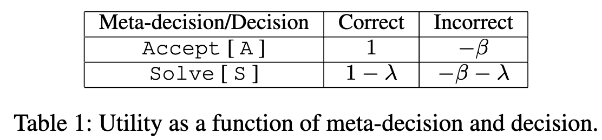
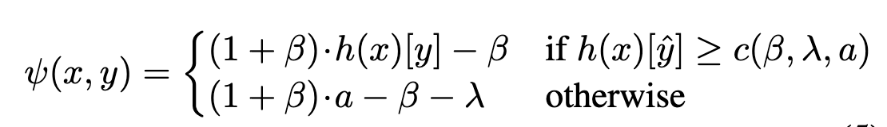
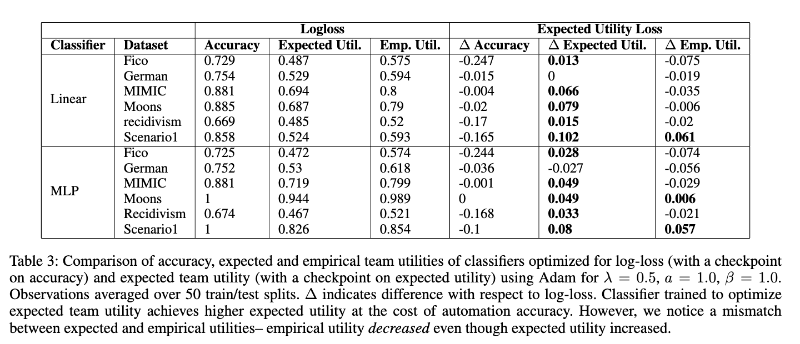

# Is the Most Accurate AI the Best Teammate? Optimizing AI for Teamwork

## 背景・目的

モデルが人間の意思決定をサポートする問題において、モデルや人間のパフォーマンスを最適化するよりも、チーム全体のパフォーマンスをか最適化する方が優先度が高い。
著者らは、この時モデルの正解率が必ず高くある必要はないことを主張した。

## 関連研究との違いは？

## 問題設定

モデルはある入力について、予測確率分布を出力する。
この出力を人間に提示し、人間はモデルの予測を受け入れるか、自分で予測するかを選択する。
この時、人間がモデルの予測を採用する場合コストはかからないが、自分で予測する場合コスト$\lambda$がかかる。
予測が出力された時、効用関数は予測の正確さと必要なコストを考慮し値を計算する。
この効用関数を最大化することを目的とする。

## 提案：解決に向けたキーアイデア

最終的な意思決定をした場合のコストの表は以下の通り。

このコストを下に、チーム全体の効用関数を次のように導いた。
$h(x)[y]$は正解$y$に対するモデルの出力の確率値を表している。

## 結果:結局問題は解決されたのか．新しくわかったことは？

チームの効用を大きくするためには、モデル自体の正解率が犠牲になる傾向があることがわかった。

## 感想

特になし
