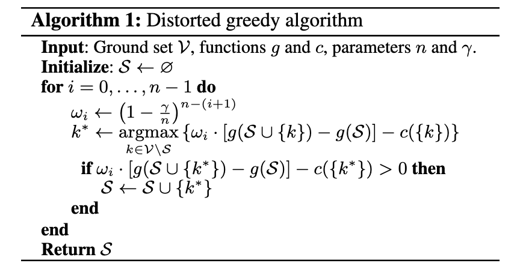
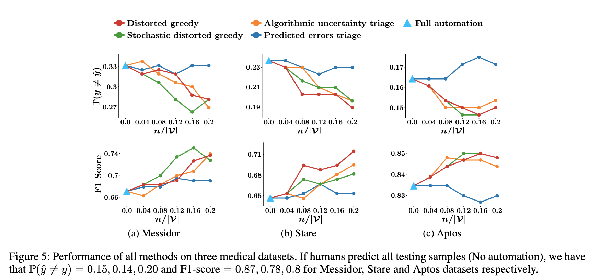

# Classification Under Human Assistance

## 背景・目的

人間と機械が行う分類問題において、予測の割り当て問題はNP困難であることを示した。
SVMを用いた分類問題において、人間が予測するデータと機械が予測するデータを事前に分割するアルゴリズムを提案した。

## 関連研究との違いは？

[[raghu2019]]の研究を元に、様々な自動化レベルにおける手法が提案された。（[[de2020]],[[mozannar2020]],[[wilder2020]])
一方でこれらの手法には理論的な裏付けがない。

## 提案：解決に向けたキーアイデア

貪欲法に基づいたデータ分割手法を提案している。
分割したデータを使って、SVMを学習し、残りのデータの予測を人間に依頼するようにする。

## 結果:結局問題は解決されたのか．新しくわかったことは？

既存手法と比較したところ、提案手法は既存手法に匹敵するスコアになっていた。

## 感想

この辺の数式をきちんと理解できるようになりたい

