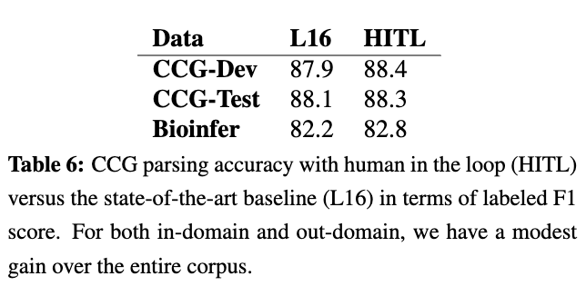

# Human-in-the-Loop Parsing

## 背景・目的

ラベル付きデータセットの作成はコストがかかる。
この論文では、CCGパーサーを対象としてHuman-in-the-Loopを用いてパーサーの精度向上を行う手法を提案している。

## 関連研究との違いは？

## 提案：解決に向けたキーアイデア

GGCパーサーの結果から、質問文を自動生成する。
この時の生成パターンはパターン化されている(Whatで必ず始まる、名詞はsomethingに置き換えられるなど)
生成したQAのペア間でスコアを計算し、最終的な質問文を決定、クラウドソーシングを使って問い合わせを行う。

ここで得られた解答を基にパーサーに対して制約をかけている。

## 結果:結局問題は解決されたのか．新しくわかったことは？

### 問題設定

SOTAなCCGパーサーをベースラインとしてCCG-Devデータセットを使って評価した。

### 実験結果

ベースラインよりも良い精度を達成した。
テーブル中のHITLが提案手法を用いた場合のスコアになっている

## 感想

