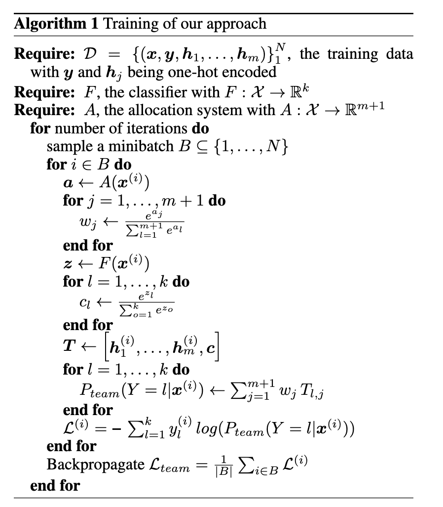

# Forming Effective Human-AI Teams: Building Machine Learning Models that Complement the Capabilities of Multiple Experts

## 背景・目的

既存研究で、MLモデルと人間の予測が相補的になるようにMLモデルの学習を行う手法が研究されてきた。
だが、MLモデルが予測するかどうかを決定するため、人間の能力の差を生かしきれていないという課題がある。

そこで、本研究では複数の人間の予測が正確ではないドメインに対して、精度がよくなるような予測を行う分類器と、人間とMLモデルのどちらかを優先するかを決定するモデルであるアロケーターの学習を行う。

## 関連研究との違いは？

[[de2021|de2021]],[[keswani2021]],[[madras2018]],[[mozannar2020]],[[okati2021]],[[raghu2019]],[[wilder2020]]では、一部のデータを1人の人間に対して依頼する手法を提案している。
[[keswani2021|keswani2021]]では、複数の人間から1人に対して問い合わせる手法を提案している。

これらの手法は、チームのうちの個人や分類器にのみ注目するように学習するため、全体のパフォーマンスを向上させることには繋がらない。

## 提案：解決に向けたキーアイデア

分類器は普通の分類を行うように学習を行う。

アロケーターは、各個人の予測に対して適切な重みを計算することで、優先度を決定している。
この重みを使って、人間の予測と分類器の予測の重み付き和を計算することで、チーム全体の予測を決定する。

学習アルゴリズムは以下の通り。

## 結果:結局問題は解決されたのか．新しくわかったことは？

ベースライン手法として[[keswani2021]]の手法と比較をした。
それ以外の対抗手法として、ランダムに人間の解答を選択する手法や人間のみのチームなどと比較をしている。

結果は以下の通り。
赤い線が提案手法になっていて、既存手法よりも良い制度を達成できていることがわかる。

