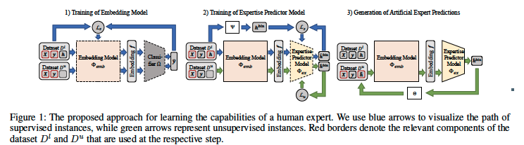

# Learning to Defer with Limited Expert Predictions

## 背景・目的

既存のL2Dの手法では、Expert側の能力を推定するために膨大な量のExpertの予測が必要になる。
この予測を入手するのは費用と時間が多く必要になる。

そのため、少ないデータ量からExpertの予測を生成することで、Expertの能力を推定し、L2Dのパフォーマンスを向上させる手法を提案した。

## 関連研究との違いは？

[[madras2018]],[[mozannar2020]],[[okati2021]],[[raghu2019]]などの手法では、人間とAIを組み合わせて問題を解く手法を提案している。

[[leitao2022|leitao2022]]はL2DのアルゴリズムがAIが予想するかそうではないかをよく決定できていることを示した。

これらの手法は全て、Expertの予測が必須である。
この論文の手法は少ないExpertの予測から、予測が付与されていないデータについて予測を付与する手法を提案している。

## 提案：解決に向けたキーアイデア

全体のフレームワークは以下の図の通り。

1段階目では、分類問題を通して分散表現を生成するモデルを学習させる。

2段階目では、Expertの予測が合っているかどうかを予測するモデルを学習させる。
学習に用いる損失関数は以下の通り。

1項目がExpertの予測とモデルによるExpertの予測が一致しているかを計算している。
2項目が、Expertの予測が無い場合、閾値以上の値を持つ確率について大きくなるように学習を行うようになっている。

## 結果:結局問題は解決されたのか．新しくわかったことは？

### 実験設定

CIFAR-100をつかって実験を行った。
このデータセット中の100個のクラスを用いてExpertの予測を行うモデルを学習させる。
予測タスクとしては、20個の大きなクラス分類を対象としている。

Expertの予測の生成に用いるデータ数を変化させ、付与したExpertの予測を用いてL2D手法を学習させ、パフォーマンスを比較した。

### 実験結果

様々な手法で学習させた分散表現や学習手法でExpertの予測を付与してパフォーマンスを比較した。
提案手法で学習させたモデルが最も良い結果であることがわかった。
また、実際のデータで学習させたところ、性別や年齢について予測の精度にばらつきがあることが確認できた。

## 感想

なんか使えそうな雰囲気している。
実験設定で、分散表現モデルを学習させるときと実際の分類問題でクラス数に差があるのが気になった。
