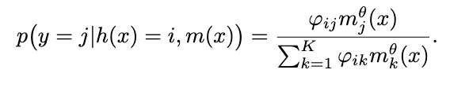
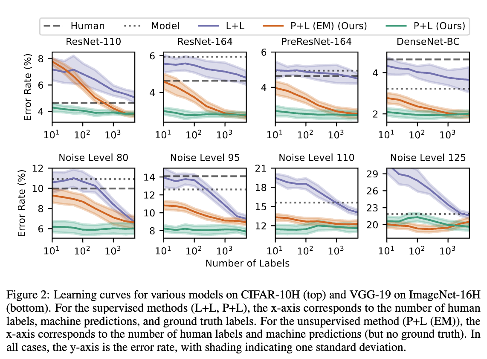

# Combining Human Predictions with Model Probabilities via Confusion Matrices and Calibration

## 背景・目的

機械の予測と人間をうまく組み合わせて良い精度を達成するための研究が行われてきた。

この論文では、人間の予測ラベルと機械の予測確率分布がある時に、機械の予測確率分布を人間の予測ラベルを用いて後処理して、予測を行う手法を提案した。

## 関連研究との違いは？

この論文とは違う文脈では、[[madras2018]]や[[raghu2019]][[mozannar2020]],[[wilder2020]],[[bansal2021]],[[okati2021]]の手法がモデルの予測と人間の予測を組み合わせる手法がある。

## 問題設定

Kクラスの分類問題を扱っている。

## 提案：解決に向けたキーアイデア

人間の予測ラベルを用いて、機械の予測確率分布を後処理する手法を提案した。
後処理の方法については、人間の予測ラベルから混同行列を推定し重みを決定している。

混同行列の初期値はディリクレ分布を用いて初期化している。

モデルの出力はそのまま用いるのではなく、パラメータ$\theta$を学習により獲得している。
MAP推定を行って、パラメータを獲得する。

これらのパラメータをEMアルゴリズムを用いて獲得し、後処理を行う。
$\gamma_{ij}$が人間の予測ラベル$i$、正解ラベル$j$の時の混同行列の値で、$m_j^{\theta}$は正解ラベル$j$に対応するモデルの出力を表している。

## 結果:結局問題は解決されたのか．新しくわかったことは？

混同行列の計算に使うデータ数を変化させて、エラー率を計測した。
Lはラベル、Pが確率分布を表していて、L+Lが機械と人間のクラスラベルを使った場合で、P+Lが機械の確率分布と人間の予測ラベルをつかった場合を表している。

エラー率は提案手法において低くなっていることがわかった。
また、L+LよりもP+Lの方がエラー率が低いことから、確率分布が重要であることがわかる。

## 感想

やろうとしていることと類似していて参考になった。
結果はなんとも言えないなと。自分の実験設定ではL+Lだから、どうしたものかという感じ。

