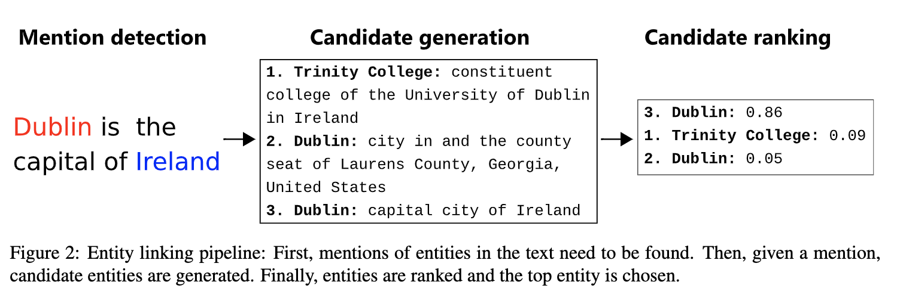
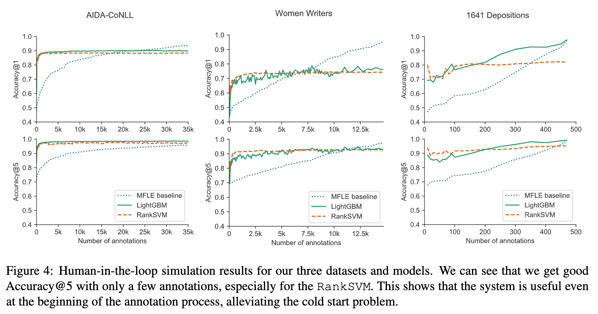

# From Zero to Hero: Human-In-The-Loop Entity Linking in Low Resource Domains

## 背景・目的

Entity Linking（EL）の学習データの作成にはコストがかかるため、限られたデータしかないケースでしか活用ができていない。
Entity Linkingタスクに用いるデータセットを作成する際のアノテーション支援を行うためのモデルをHuman-In-The-Loopで学習させる手法を提案した。

## 関連研究との違いは？

## 提案：解決に向けたキーアイデア

ELの推薦までのシステム構成はfig2のようにしてやる。

### Mention Detection
アノテーターが過去にアノテーションした単語に対してマッチングアルゴリズムを使って、同じ文字列を検索し、Detectionを行う。
実験の中では、Levenshtein距離を使った場合も比較されていた。

### Candidate generation
既存の知識ベースからMention Detectionで引っかかった単語に対して検索を行う。
その単語に対して関連がありそうな単語を列挙していく。

### Candidate ranking
Candidate generationで列挙された単語をランク付けしていく。
ここでHuman-In-The-Loopを採用していて、候補の中から選択された単語が最も好ましいとして学習を行う。
使用するモデルはLightGBMとRankSVMを用いる（DNNは遅いので用いない）

## 結果:結局問題は解決されたのか．新しくわかったことは？

ユーザー実験を用いて、実験を行った。
実験プラットフォームは[[Klie2018|The INCEpTION Platform: Machine-Assisted and Knowledge-Oriented Interactive Annotation]]で提案されているものを用いた。
10個のエンティティについて推薦なしでアノテーションをしてもらい、RankSVMとLightGBMの学習を行った。
その後、推薦ありでアノテーションを行い、いくつかのエンティティをアノテーションした後、モデルの学習を行いパフォーマンスを集計した。

Accuracy@kはランキングの上位k位以内正解が含まれていた割合を表している。

アノテーション数が少ない段階でも、Accuracy@1とAccuracy@5が高いことがわかった。
データが少なくても、良い候補を提示できていることがわかった。
