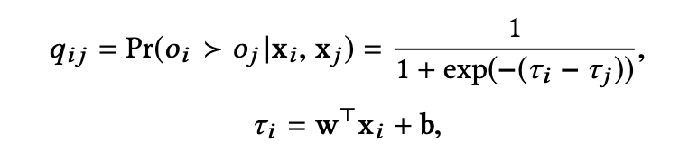
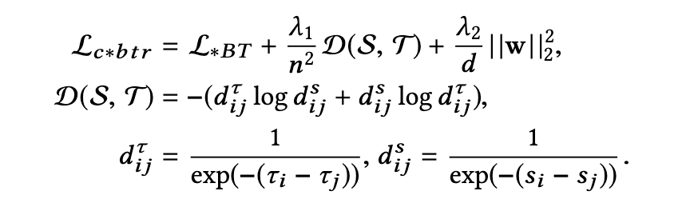

# Context-based Collective Preference Aggregation for Prioritizing Crowd Opinions in Social Decision-making

## 背景・目的

オンラインの投票システムの普及により、様々な意見に対する嗜好データが手に入るようになってきた。
だが、それらのデータをうまく使った集合知を扱うことはできていない。

そこで文脈情報を考慮した、嗜好推定アプローチを提案する。

## 関連研究との違いは？

## 問題設定（この論文で解決される未解決問題は？）

クラウドワーカーから得た意見の集合を$\mathcal{O}$、その意見の$i$番目$o_i$を言語モデルによってベクトル化したものを$x_i$とする。

ここから、ある意見$o_i$に対する嗜好度スコア$s_i$とバイアス値$\beta^l$を推定する。

## 提案：解決に向けたキーアイデア

嗜好度スコアを以下の式で計算する。

この嗜好度スコアを基に、以下の損失関数で学習を行う。
$\mathcal{L}_{*BT}$は論文中で提案されている損失関数の種類を表す。

## 結果:結局問題は解決されたのか．新しくわかったことは？

実データセットで実験したことくらいしかわからなかった。
結果はよくわかんなかった。

## 感想

CrowDEAの特徴量を言語モデルのベクトル表現に変えただけのように見えた
