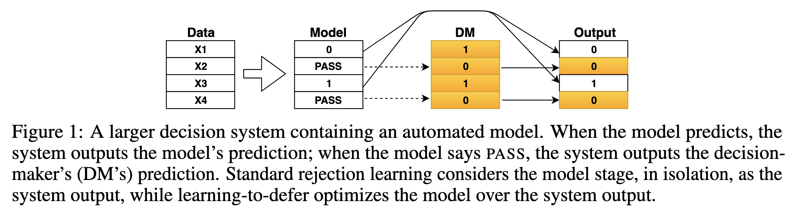
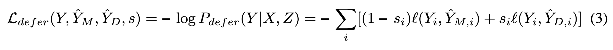
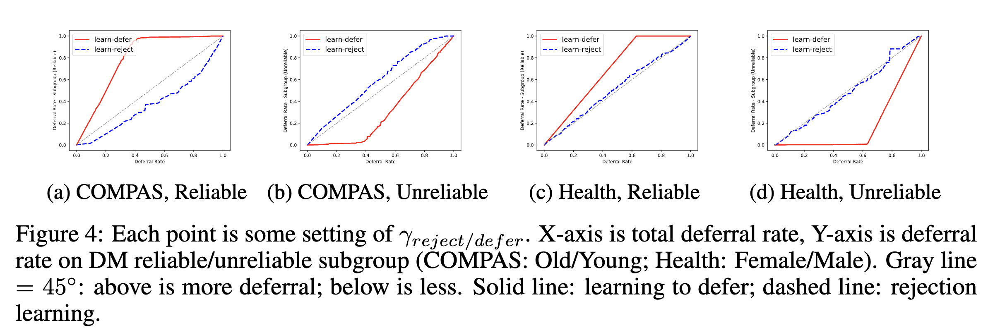

# Predict Responsibly: Improving Fairness and Accuracy by Learning to Defer

## 背景・目的

rejection learningはモデルに予測をしないという決定をさせた手法であるが、この手法は適応的ではない。
人間とモデルが協調して問題を解くためには、モデルの弱みだけではなく、人間の弱い点や公平さを考慮する必要がある。

この論文では適応的なrejection learningの手法を提案している。（Learning to Defer）

## 関連研究との違いは？

## 提案：解決に向けたキーアイデア

扱う問題設定は下の図のような感じ。
図中のModelが学習により獲得するモデルになる。

モデルの学習に使う損失関数は下の関数。
$s_i=1$の時モデルの予測を採用し、$s_i=0$の人間に予測を依頼する。
$Y_i$が正解ラベル、Mがモデルの予測、Dが人間の予測を表している。

## 結果:結局問題は解決されたのか．新しくわかったことは？

人間の予測にバイアスを意図的にかけたデータなどを作成して、実験を行った。

### 正解率の良い人間の場合

rejection learningよりも良い精度と公平性のバランスを取れていることが確認できた

### バイアスの強い人間の場合

グループ毎（正解カテゴリ）毎に人間に依頼された割合が異なっていた。

