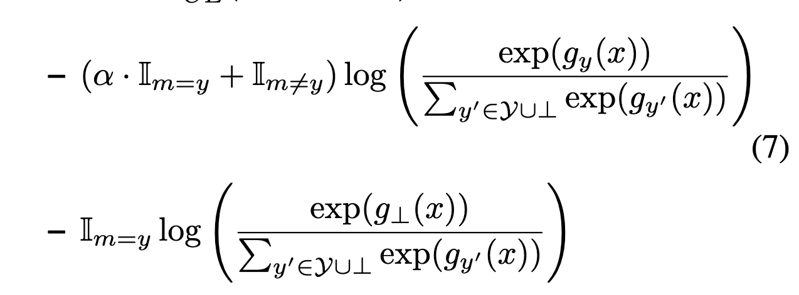

# Consistent Estimators for Learning to Defer to an Expert

## 背景・目的

MLモデルは人間の意思決定をサポートするようなシステムに組み込まれてきている。
ここで、モデルと人間で協調してタスクを解き、良いパフォーマンスを出すことは重要である。

## 関連研究との違いは？

[[wilder2020]]や[[Madras2018]], [[Raghu2019]]らの手法は、この論文で考えている問題設定と異なる。
人間が分類器の予測を受け入れるか拒否するかを決定している。

## 提案：解決に向けたキーアイデア

モデルが学習を行うのは、classifierとrejectorの2つの関数を学習させる。

損失関数は以下の通り。

１項目でclassifierの学習を行い、2項目でrejectorに使うための関数を学習する。
２項目のラベルが、人間が予測した場合の予測の正しさを推定している。

$\alpha$で、モデルと人間の予測のどちらを優先するかを決定する。

## 結果:結局問題は解決されたのか．新しくわかったことは？

CIFAR-10を使って実験を行っている。
実験時の人間は、一部のクラスを完璧に予測することができるモデルを用いている。

ベースラインよりも良い精度を達成している。

