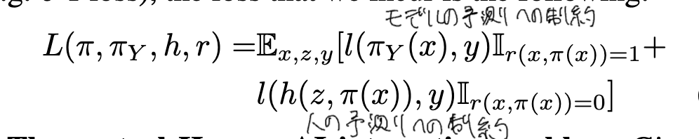
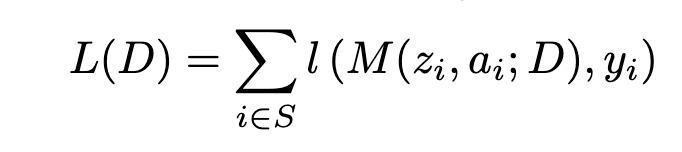
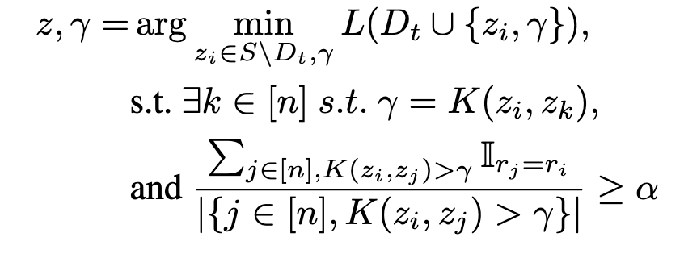
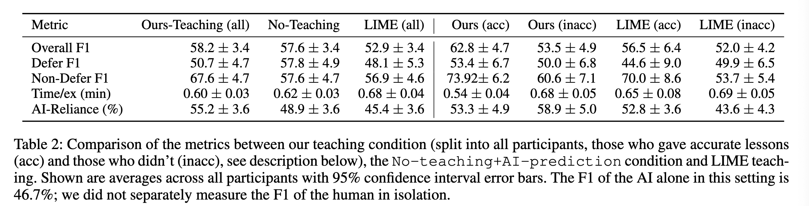

# Teaching Humans When To Defer to a Classifier via Exemplars

## 背景・目的

AIが支援した場合、人間の意思決定がどう変化するか、どのような場合人間はAIの支援を受けるのかを知ることは重要になっている。
そこで、Rejectorとして人間の意思決定をモデル化する手法を提案した。

## 関連研究との違いは？

[[madras2018]],[[raghu2019]],[[mozannar2020]]らはモデルが予測するか人間が予測するかを決定するモデルであるRejectorの学習を行う手法を提案した。
今回扱う問題設定では、人間に対していつAIの予測を採用するべきかを教えることだ。

## 問題設定

AIと人間が協調して特徴量$\mathcal{X}$からラベル$\mathcal{Y}$を予測するタスクを行う。
AI側は、予測関数$\pi_{Y}$と人に対するメッセージ$\mathcal{A}$を出力する関数$\pi$から構成される。

人間は、AIからのメッセージである$\mathcal{A}$を受け取り、予測を行うかどうかを決定する。

## 提案：解決に向けたキーアイデア

### システム側の目的関数

モデルの予測に関する損失と、人間が予測した場合の損失の和を最小化するように学習を行う。

### 人間側の目的関数

人間側では、予測の境界$D$を学習させる。
この$D$を境界上にあるデータ集合$S$に対して学習をおこなう。

この$S$は貪欲法に基づいて更新される。

## 結果:結局問題は解決されたのか．新しくわかったことは？

クラウドワーカーをつかった実験では、既存手法よりも良い結果を出した。

## 感想

既存のL2Dとは逆のアプローチで面白かった。
問題設定がちがうからなんともいえないけど。

