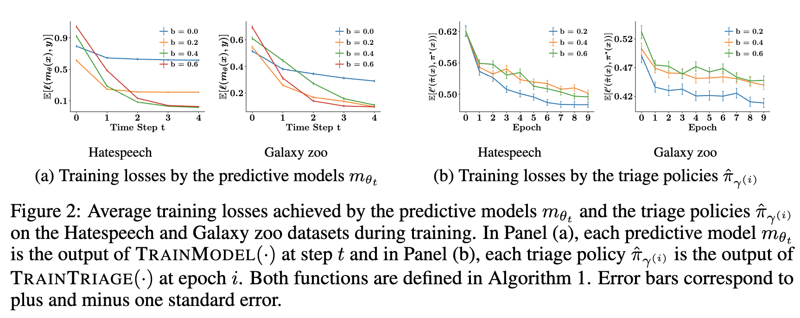

# Differentiable Learning Under Triage

## 背景・目的

[[raghu2019|Raghu2019]]で提案されているAlgorithmic Triageは、人間の苦手なドメインの予測に予測モデルを割り当て、予測モデルの苦手な分野に人間を割り当てる手法である。
この手法において、人間と予測モデルの正解率の関係はよくわかっていない。
そこで、理論的に上の関係を分析し、あらたなTriage Poricyを提案した。

## 関連研究との違いは？

[[raghu2019|Raghu2019]]らの研究でAlgorithmic Triageが提案された。
この研究から2つの分野に別れていき、[[raghu2019|Raghu2019]][[wilder2020]],[[Bansal2021]]らの手法は理論的な保証がなく、[[de2020]][[de2021]],[[mozannar2020]]らの手法は理論的な保証がある。
一方で、後者の手法は状況が限定的である。
例えば[[de2020]]や[[de2021]]では、回帰問題やSVMによる分類問題を扱っている。

## 提案：解決に向けたキーアイデア

アルゴリズムは以下のような感じで学習を行う。

Triage Policyと予測モデルの学習を同時に行う。

## 結果:結局問題は解決されたのか．新しくわかったことは？

HatespeechとGalaxy Zooデータセットで学習を行なった。
この手法で、予測モデルとTriage Policyが手法で学習できたことがわかる。

誤分類率で比較すると既存手法に匹敵する手法であることがわかる。

## 感想

数式わかんないから、きつい
予測モデルと人間の関係がよくわかんなかったのは残念
