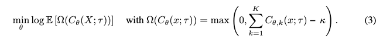
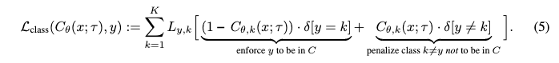
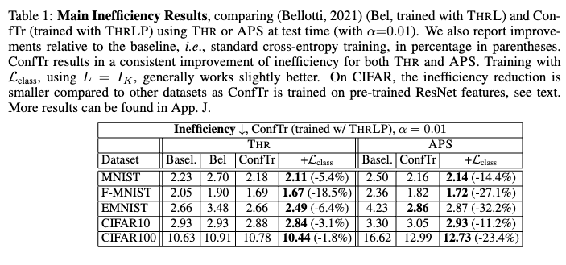

# Learning Optimal Conformal Classfiers

## 背景・目的

これまでのCPの研究は、モデルの出力した予測確率に対して後処理を追加する手法の提案が行われていた。
この論文では、後処理部分も含めて微分可能な形で定義し、学習する手法を提案した。

## 関連研究との違いは？

## 問題設定

モデルの出力を使って、提案セットを作成する問題を扱う。
このセットの中に含まれる予測の中に正解ラベルがあり、このセットの大きさが大きくなりすぎないようにすることが目的

## 提案：解決に向けたキーアイデア

以下の2つの式の損失の重み付き和をモデルの学習に使う損失関数とする。

1つ目は、生成される提案セットの数が大きくなりすぎないようにする損失関数。

2つ目が、正解となるラベルが予測セットに含まれるように学習を行う関数。

## 結果:結局問題は解決されたのか．新しくわかったことは？

Inefficiencyについての評価は、既存研究よりも良い結果であった。

Coverageの混同についても評価されていたが、よくわからなかった。

## 感想

全体的に読みやすかった。

Coverageについて、普通の評価が見当たらなかったのが気になる。
