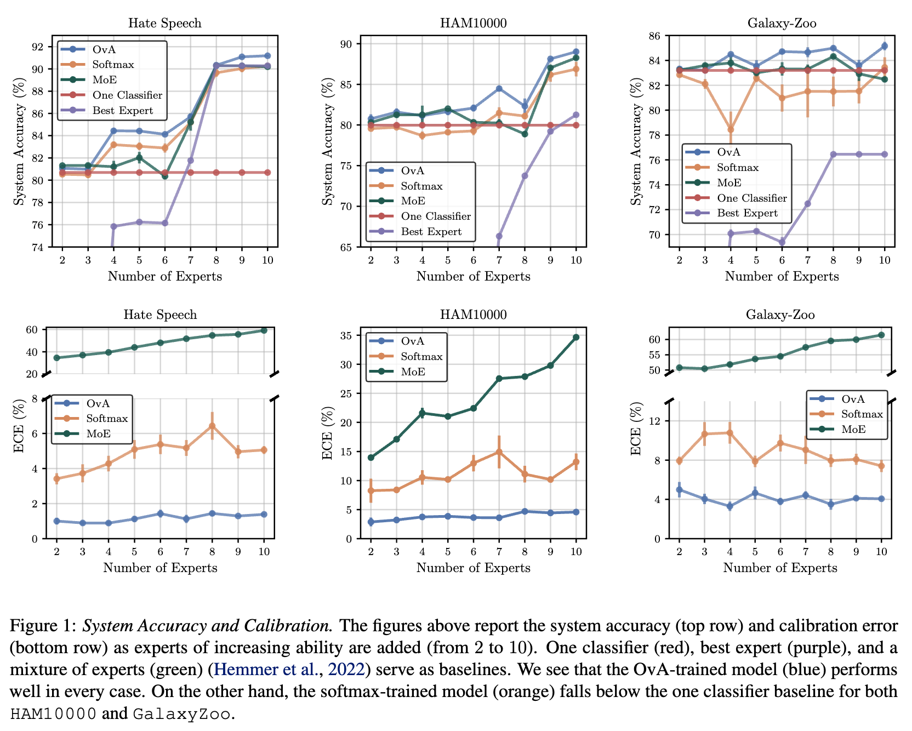

# Learning to Defer to Multiple Experts: Consistent Surrogate Losses, Confidence Calibration, and Conformal Ensembles

## 背景・目的

L2Dフレームワークにおいて、複数の問い合わせ先を考慮することは検討されていなかった。
そこで、[[mozannar2020]]や[[verma2022]],[[hemmer2022]]で提案されている手法を複数の人間を考慮した手法に拡張し、理論的な証明を行った。

## 関連研究との違いは？

[[madras2018]]らがL2Dフレームワークを提案した。
このフレームワークを基に、[[mozannar2020]]ではSofmaxベースの損失関数を提案し、[[verma2022]]ではOvAベースの手法を提案してる。
このほかにも、[[raghu2019]]、[[wilder2020]]、[[okati2021]]などの拡張された手法がある。
ここでは、問い合わせをする人は1人であることが仮定されている。
[[hemmer2022]]では、複数の人間の解答を用いる手法を提案している。

## 提案：解決に向けたキーアイデア

基本的に、人間の数だけ追加のラベルを用意する。
このラベルを使うことで学習を進めていく。

分類器とrejectorの定義は以下の通り。

### Softmaxベースの損失関数

この手法では、j番目の人間が正解したら、その人に対応したラベルの出力を大きくするように学習を行う。

### OvAベースの損失関数

本論文をあまり読んでいないので、わからない

### MoEベースの手法

ある特徴量において、全ての人間に対する重みを計算し、重み付き和を計算し、予測を行う手法。

## 結果:結局問題は解決されたのか．新しくわかったことは？

上記の3つの手法と、人間のみ、分類器のみの場合のスコアを比較。
それぞれのデータセットにおいて、OvAベースの損失関数の方が精度が良いことがわかった。

