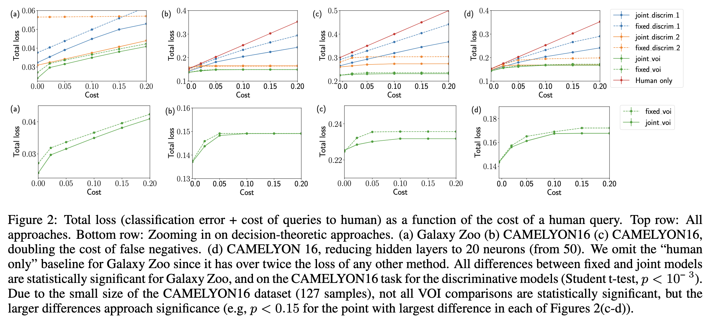

# Learning to Complement Humans

## 背景・目的

機械学習を用いて人を支援するシステムは、モデルのパフォーマンスに注目されてきた。
これは人間の専門性を無視していることになる。
この論文では、人間と機械で協調した場合のパフォーマンスを向上させることを目的としている。

## 関連研究との違いは？

## 提案：解決に向けたキーアイデア

予測に対する効用関数を使い、最適化を行う。

### 微分可能な形式のアプローチ

損失関数を効用関数を定義し、人間に対する効用についてコストの制約をかけた手法。

### 決定論的アプローチ

事後確率を計算し、それを用いてパラメータを更新する。
人間の効用関数と機械の効用関数を推定し、予測先を決定する。

## 結果:結局問題は解決されたのか．新しくわかったことは？

全体の損失の推移は以下のような感じ。
jointモデルの方が、fixedモデルよりも良い結果を出している。

