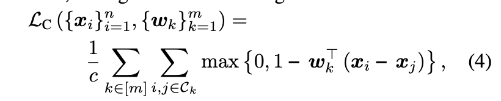
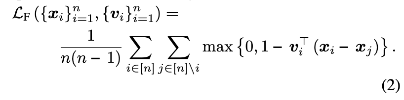
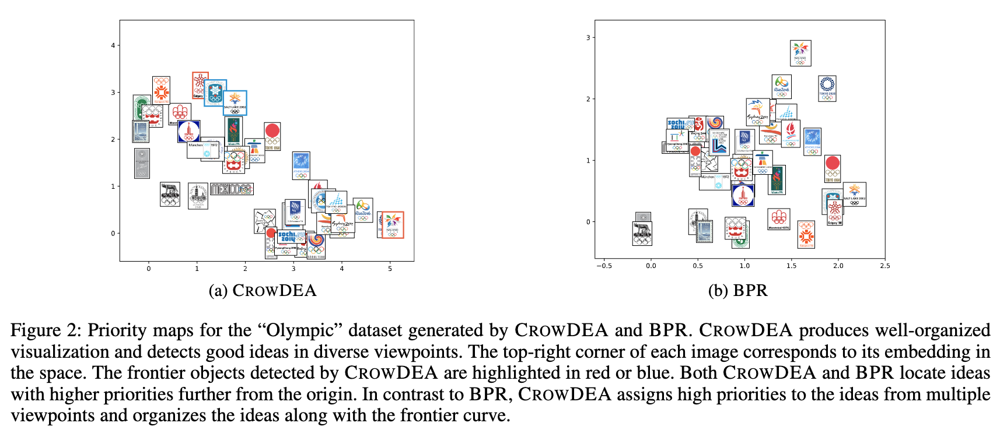

# CrowDEA: Multi-view Idea Prioritization with Crowds

## 背景・目的

人間の意見をまとめる時、ベストなアイデアは複数存在する。
この論文では、アイデアを様々な観点から優先度付けする手法を提案している。

## 関連研究との違いは？

## 問題設定（この論文で解決される未解決問題は？）

$n$個のアイデアから、異なる評価軸を用いてランキングする問題を考える。
$i$番目のアイデアを表すベクトルを$\bm{x}_i\in \mathbb{R}^d$とする。
これを単位ベクトル$\bm{v}_i$で射影($\bm{v}_i^T\bm{x}_i$)することで好みスコアを計算する。

これとは別に、一対比較を用いて$m$人のクラウドワーカーにアイデアを評価してもらい、クラウドワーカー毎の評価スコアを単位ベクトル$\bm{w}_k$を用いて計算する（内積の計算）。
一対比較の結果は$\mathcal{C}_k  = \{(i,j)| i,j \in [n], i \succ_k j\}$に格納されている。

## 提案：解決に向けたキーアイデア

$i$番目のアイデアを$j$番目のアイデアよりも好む場合、以下の制約を満たすとする。

$$\bm{v}_i^T \bm{x}_i > \bm{v}_i^T \bm{x}_j, \forall i \in [n], \forall j \neq i \in [n]$$
$$\bm{w}_k^T \bm{x}_i > \bm{w}_k^T \bm{x}_j, \forall k \in [m], \forall (i,j) \in \mathcal{C}_k$$

この制約を満たすようにヒンジ損失をベースとした損失関数を提案した。

1つ目の制約に関する損失は以下の式で計算する。

2つ目の制約に関する損失は以下の式で計算する。

これらの損失関数の重み付き和を全体の損失として学習を行う。

## 結果:結局問題は解決されたのか．新しくわかったことは？

実データセットで学習させ、$d=2$とした時の重みを以下の図のに可視化した。
赤枠や青枠で囲われている画像は、CrowDEAが一対比較の結果良いと判断したものを表している。

右下にはカラフルな画像があり、左上には比較的シンプルなものが配置されていることがわかる。

## 感想

読みやすかった。

可視化の軸は後付できるくねとは思った。批判的に論文を読める様になりたい。

